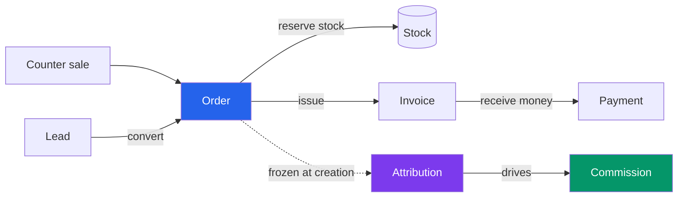
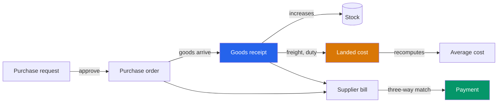
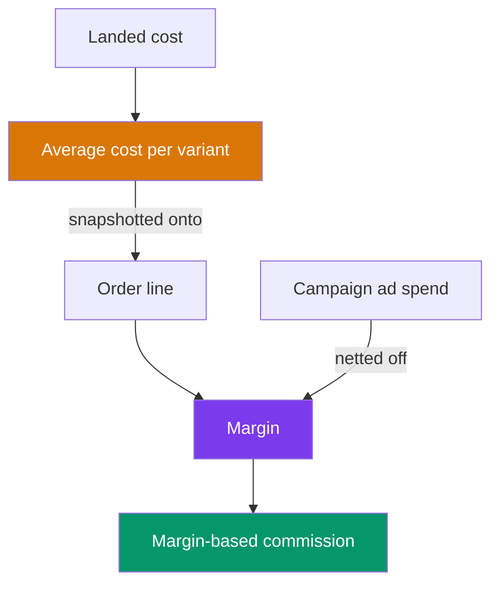

# SME ERP

A business operating system for a small company that has outgrown spreadsheets — sales, stock,
purchasing, invoicing, commission and marketing attribution, in one place.

Most ERPs can tell you *what* you sold. This one is built to answer two harder questions:

> **Where did this order come from — and who is owed for it?**

Every order carries a frozen record of the campaign, channel, marketer and salesperson behind it.
Commission is calculated from that record, and can explain every ringgit it pays.

---

## How work flows through it

### Selling

A counter sale and a quoted order end up in the same place — **a POS sale *is* an order**, paid and
handed over in one step. That is deliberate: if the till wrote its own records, stock, commission,
attribution and every report would immediately fork into two truths.



A lead becomes an order. The order snapshots its prices, its costs and **who deserves credit** — all
at the moment it is placed. Stock is reserved, an invoice is issued, money arrives. Commission
accrues against the attribution frozen on day one, so re-running last quarter gives the same answer
it gave then.

### Buying



Someone asks to buy something. Once approved it becomes a purchase order. When goods arrive, stock
moves in the same transaction as the receipt. Freight and duty are apportioned across the lines, so
**average cost reflects what the goods really cost you** — not the price typed on the order.

A supplier bill is only payable if it matches the order *and* what actually arrived.

### Why the two flows meet



This is the part most systems get wrong. If commission is paid on margin, then **a costing error is
a payroll error** — and the person underpaid will notice. So cost flows all the way from a freight
invoice to somebody's commission statement, and every step is recorded.

---

## The three ideas it is built on

### 1. Attribution is frozen, never recomputed

When an order is created, the campaign, channel, marketer, salesperson, team and branch behind it are
written onto an `attributions` row and never touched again. Change a campaign next month and last
month's commission does not move.

The attribution screen answers seven questions from that frozen data: revenue by campaign, by
channel, by marketer, by salesperson, by branch; spend against return; and cost per lead.

### 2. Commission explains itself

A plan says *who* gets paid and *on what*. A rule under it says *how much* — and **every rate change
publishes a new version rather than editing the old one**. The database physically refuses to update
a published rate.

Open any commission and it tells you the rule, the version, the basis, the rate and the arithmetic
that produced the number.

```
Purchase 60.00 plus freight 10.00 per unit = 70.00
Margin 130.00 × 5% = 6.50
```

### 3. Permission is not the same as reach

Two questions, always asked separately:

| | |
|---|---|
| **Permission** | May this role do this at all? |
| **Data scope** | Of the records it covers — which ones? |

A salesperson and a branch manager may both hold `orders.view`. One sees their own orders, the other
sees the branch. Five scopes — own, team, branch, company, all — tunable per role, per permission,
from a screen.

**And the boundary is the server.** The interface hides buttons for usability; every privileged
action is refused again in the controller, and each refusal has a test that posts straight to the
endpoint with the button hidden.

---

## What you can actually do in it

| Area | Screens |
|---|---|
| **Sales** | **Point of sale** — till sessions, split tenders, printable receipts, refunds · **Pipeline board** with weighted forecast and follow-ups · Customers · Leads · Orders (lines, attribution, history, commission) · Invoices with ageing |
| **Catalogue** | Products with inline variants · Inventory with movement history and adjustments |
| **Purchasing** | Purchase requests · Purchase orders · Goods receipts with landed cost · Supplier bills with three-way match · Approvals inbox |
| **Money** | Commission with period totals and full explanations · Commission plans, rules and versioned rates |
| **Marketing** | Channels · Campaigns with ad spend · Marketers · Attribution reports |
| **Administration** | People · Roles and reach · Branches · Audit log |

Navigation is built on the server — a menu entry appears only if the module is active, enabled for
your company, permitted to you, **and points at a route that resolves**. A sidebar link can never
lead to a 404.

---

## How it is built

| Layer | Choice |
|---|---|
| Backend | Laravel 12, PHP 8.4 |
| Database | PostgreSQL 16 |
| Frontend | Inertia 3 + React 19 + TypeScript (strict) + Bootstrap 5, built with Vite |
| Queue | Redis + Laravel Horizon |
| Keys | ULID everywhere |
| Money | `NUMERIC(15,4)` with a bcmath value object — **never floats** |

A few decisions worth knowing about:

- **Ledgers are append-only in the database, not just in code.** Stock movements, journal lines,
  order events, audit logs and published commission rates all reject `UPDATE` at the trigger level.
  A bug cannot quietly rewrite history.
- **Money never touches a float.** Every amount is a string through a `Money` value object.
- **Order status moves on three independent tracks** — payment, fulfilment and exception — because
  an order can be paid and unshipped, or shipped and unpaid, and one status column cannot say that.

---

## Getting started

```bash
composer install && npm install
cp .env.example .env && php artisan key:generate

createdb sme_erp && createdb sme_erp_test
php artisan migrate
php artisan db:seed --class=PermissionSeeder
php artisan db:seed --class=ModuleSeeder

php artisan erp:create-owner     # prompts for company, name, email, password

npm run dev        # terminal 1
php artisan serve  # terminal 2
```

Then open `http://127.0.0.1:8000/login`.

Requirements: PHP **8.4+** with `pdo_pgsql`, `bcmath` and `intl`; PostgreSQL **16** (15+ is required
for `UNIQUE NULLS NOT DISTINCT`); Redis 7+; Node **20.19+**.

**No demo accounts ship with this, deliberately.** No seeder creates a user, so no known credential
can ever reach production. Create the first owner with the command above; everyone after that is
added from **Administration → People**.

> **Upgrading:** a release that adds a permission does not reach existing companies until you run
> `php artisan erp:sync-roles`. It leaves any data scope you have tuned alone.

Scheduled work — rollups, the reservation sweep, nightly backups and a weekly restore rehearsal —
needs one cron entry. See [`DEPLOYMENT.md`](DEPLOYMENT.md).

---

## Testing

```bash
composer gate          # Pint + PHPStan + Pest
./vendor/bin/pest
```

**1,496 tests, 2,879 assertions**, in six suites that each do a different job:

| Suite | What it protects |
|---|---|
| `Unit` | Money arithmetic, enums, the permission registry |
| `Architecture` | Source-level rules — no unscoped raw queries, status columns written only by the state machine, every module route resolves |
| `Isolation` | Company isolation and data scope. **Reflection-driven** — a new scoped model is covered the moment it exists |
| `Feature` | Domain behaviour end to end, plus query budgets |
| `Concurrency` | Real multi-process races: document numbering, stock reservation, order transitions |
| `Security` | Hardening assertions and the PDPA erasure path |

### One rule this project is strict about

**A test that has never been seen to fail proves nothing.**

Every authorization guard here was verified by deleting it, watching the test go red, and restoring
it. That practice has caught nine cases where a test was green for the wrong reason — usually
because a *different* guard was doing the refusing. Green suites are not evidence; falsified ones
are.

---

## What is not built

Stated plainly, because a README that only lists strengths is not useful.

- **No screen has been used by a human to do a day's work.** Every claim here rests on tests and a
  build.
- **No external security review.** [`SECURITY-REVIEW.md`](SECURITY-REVIEW.md) is the brief prepared
  for one.
- No exports, no credit notes, no 2FA, no password reset by email.
- Attribution cannot yet be captured from the web — no UTM or landing-page endpoint, so the campaign
  on an order must be set deliberately.
- No setup screens for price lists, territories, referral codes or approval flows.
- Tiered commission rates are stored and honoured by the engine, but the screen publishes a flat
  rate only.

---

## Documentation

| | |
|---|---|
| [`Planning.md`](Planning.md) | Architecture decisions, every phase gate, and an appendix per wave recording what broke and why |
| [`DEPLOYMENT.md`](DEPLOYMENT.md) | Server setup, scheduler, backups, post-deploy checklist |
| [`SECURITY-REVIEW.md`](SECURITY-REVIEW.md) | Scoping brief for an external reviewer — including where I would attack it |

`Planning.md` is worth a look if you want the reasoning rather than the result. It records the
defects honestly, including ones that were live for months: a by-weight landed cost that apportioned
nothing because a missing relation made `?? 0` swallow it, and a seeder that would have silently
widened every tuned permission scope on the next deploy.
